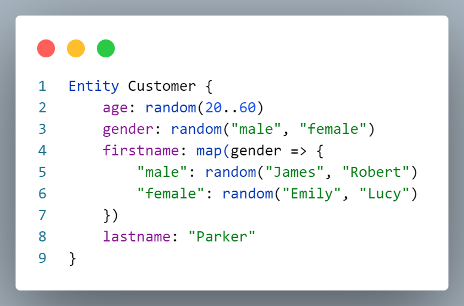

# Ranger: A test data generator

There are many libraries out there that generate fake data to facilitate testing.

However, Ranger takes a different approach.
Instead of providing pre-built data, it enables users to create customized test data for their specific use case using the **Ranger language**.

Here we have an example Ranger file

<!-- markdownlint-disable MD033 -->


that produces output similar to

```json
{"age":21,"gender":"male","firstname":"James","lastname":"Parker"}
{"age":58,"gender":"male","firstname":"James","lastname":"Parker"}
{"age":26,"gender":"female","firstname":"Emily","lastname":"Parker"}
{"age":51,"gender":"male","firstname":"James","lastname":"Parker"}
{"age":59,"gender":"male","firstname":"Robert","lastname":"Parker"}
{"age":60,"gender":"female","firstname":"Lucy","lastname":"Parker"}
{"age":41,"gender":"male","firstname":"Robert","lastname":"Parker"}
{"age":51,"gender":"female","firstname":"Lucy","lastname":"Parker"}
{"age":41,"gender":"male","firstname":"James","lastname":"Parker"}
{"age":39,"gender":"male","firstname":"Robert","lastname":"Parker"}
```

Note that each individual's first name corresponds to their gender.

## How does it work?

Using the Ranger language, you can design test entities specific to your needs in a `.ranger` file. Once you've configured your entities, you can generate test data in one of two ways:

* Use the Ranger command line interface to create CSV or JSONL files containing the data.
* Utilize the JavaScript API to generate JavaScript objects and integrate them directly into your code.

## Getting started


## What's in the folder

This folder contains all necessary files for the Ranger DSL language extension.

* `package.json` - the manifest file in which language support is declared.
* `language-configuration.json` - the language configuration used in the VS Code editor, defining the tokens that are used for comments and brackets.
* `src/extension.ts` - the main code of the extension, which is responsible for launching a language server and client.
* `src/web/extension.ts` - does the same when using the extension as a web extension for running VS code within a web browser.
* `src/language-server/ranger.langium` - the grammar definition of the Ranger DSL language.
* `src/language-server/main.ts` - the entry point of the language server process.
* `src/language-server/ranger-module.ts` - the dependency injection module. Use this to register overridden and added services.
* `src/language-server/ranger-validator.ts` - the validator module containing custom validations.
* `examples` - folder containing sample `.ranger` files.

## Get up and running straight away

1. Ensure that [Node](https://nodejs.org/en/download/) is installed.
2. Run `npm install` to download all project dependencies.
3. Run `npm run build` to generate TypeScript code from the grammar definition and to compile all TypeScript code to JavaScript.
4. Press `F5` to open a new window with your extension loaded (aka VS Code Debug instance).
5. Open a file inside `examples` folder or create a new file with file name suffix `.ranger`.
6. Verify that syntax highlighting, validation, completion etc. are working as expected.

## Make changes

* Run `npm run watch` to have the Langium generator and TypeScript compiler run automatically after every change of the source files.
* You can relaunch the extension from the debug toolbar after making changes to the files listed above.
* You can also reload (`Ctrl+R` or `Cmd+R` on Mac) the VS Code window with your extension to load your changes.

## Debug

1. Make sure that the right launch configuration is enabled:
   * Open VSCode command palette (Windows: `Ctrl+Shift+P`, MacOS: `Cmd-Shift-P`).
   * Type `Show Run and Debug` and press Enter to switch to Debug view.
   * Switch to launch configuration `Debug Extension` in the dropdown menu in the upper left corner.
2. Set breakpoints as you like in any TypeScript file.
3. Press `F5` to run VSCode Debug instance.

## Test

* Add your `**.test.js` file to `test` folder.
* Run `npm test`.
* Alternatively, you can use VS Code extension [Vitest](https://marketplace.visualstudio.com/items?itemName=ZixuanChen.vitest-explorer) to run the tests.

## Package

* Run `npm run package` to create a VS Code `.vsix` extension file that can be installed in any VS Code editor.

## To Go Further

Documentation about the Langium framework is available at <https://langium.org/docs>.

Langium GitHub-Repository with lots of sample code: <https://github.com/langium/langium>.
